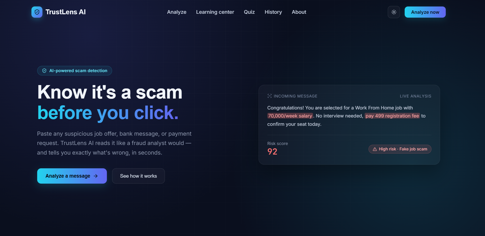
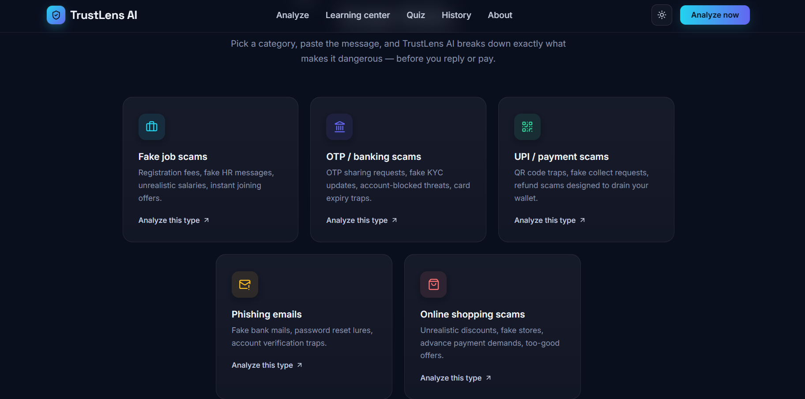
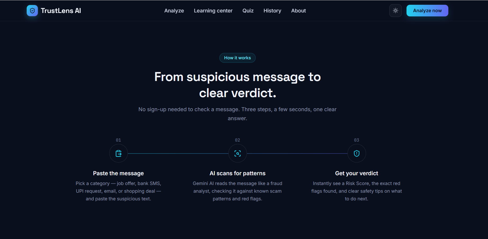
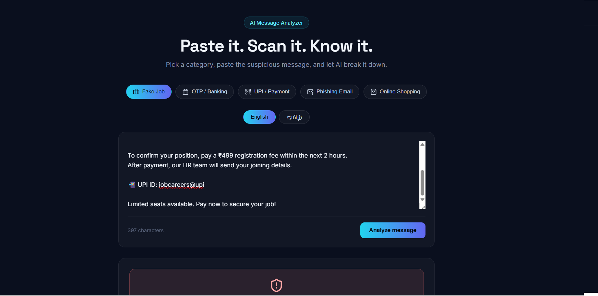
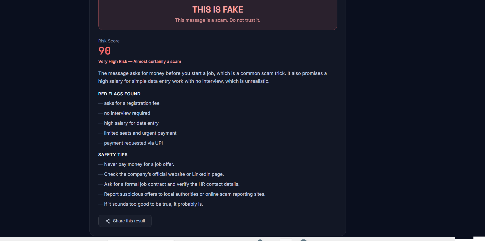
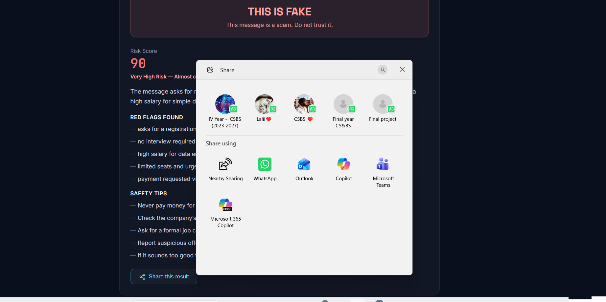

# 🛡️ TrustLens AI
## Live Demo
[🚀 Try TrustLens AI](https://trustlens-ai-beige.vercel.app/)

TrustLens AI is an AI-powered scam detection tool that helps users identify suspicious messages before they click, reply, or make a payment.

It analyzes messages for common scam patterns and provides a clear risk score, explanation, red flags, and safety tips.

## 🚀 Live Demo

[View TrustLens AI](YOUR_LIVE_LINK_HERE)

## 📸 Screenshots

### 1. Home

### 2. Features

### 3. How It Works

### 4. Analyze

### 5. Analyze Result

### 6. Share Result

## ✨ Features

- 🔐 OTP and Banking Scam Detection
- 💼 Fake Job Scam Detection
- 💳 UPI / Payment Scam Detection
- 📧 Phishing Email Detection
- 🛍️ Online Shopping Scam Detection
- 📊 AI-powered Risk Analysis
- 🛡️ Clear Safety Tips
- 📚 Scam Awareness Learning Center
- 🧠 Interactive Scam Quiz
- 🕘 Analysis History

## 🧠 How It Works

1. **Paste the suspicious message**  
   Enter a suspicious job offer, bank message, payment request, email, or shopping message.

2. **AI analyzes the message**  
   The AI checks the message for common scam patterns and suspicious signals.

3. **Get a clear verdict**  
   TrustLens AI provides a risk score, detected red flags, explanation, and safety recommendations.

## 🎯 Purpose

Online scams are becoming increasingly difficult to identify. TrustLens AI is designed to provide a quick and simple second opinion before users respond to suspicious messages or make payments.

The goal is to make basic scam awareness and detection accessible to everyone, regardless of their technical background.

## 🛠️ Built With

- React.js
- React Router DOM
- JavaScript (ES6+)
- HTML5
- CSS3
- OpenRouter AI API
- LocalStorage
- lucide-react

## 📂 Main Pages

- **Home** – Introduction and scam categories
- **Analyze** – AI-powered scam analysis
- **Learning Center** – Scam awareness and educational content
- **Quiz** – Interactive scam awareness quiz
- **History** – Previously analyzed messages
- **About** – Information about the project

## 🔮 Future Scope

- Community-based scam reporting
- Voice scam analysis
- Image-based scam detection
- Support for more Indian languages
- Real-time scam alerts

## 👩‍💻 Developer

TrustLens AI was built as a project to demonstrate how AI can be applied to a real-world safety problem and make scam detection easier and more accessible.

---

⭐ If you find this project useful, consider giving it a star!
